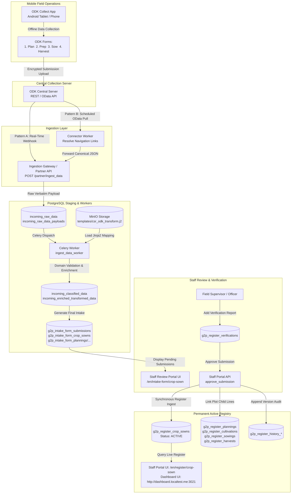

# Crop Sown Registry

An installable **Crop Sown Registry** built as a thin extension of the OpenG2P
[registry platform](https://github.com/OpenG2P/registry-platform), following the
same inverted build model as the
[Farmer Registry](https://github.com/OpenG2P/farmer-registry): the platform
publishes the runnable base images and the `openg2p-registry` Helm chart; this
repo adds **only** the crop sown domain on top.

The domain is ported from the Odoo module `g2p_crop_registry` (`g2p.crop.registry`
and its planning / cultivation / sowing / harvesting lines) onto the platform's
register model.

## What this repo owns

| Path | Purpose |
|---|---|
| `cropsown-extension/` | The crop sown domain package — models, schemas, services, seed metadata (registers, AWE policy, DCI templates) |
| `dashboard-ui/` | The Crop Sown Registry analytics dashboard (the view behind the portal's Dashboard button) |
| `docker/` | Thin Dockerfiles (`FROM openg2p/openg2p-registry-*` + `pip install cropsown-extension`) selected at runtime by `REGISTRY_EXTENSION_MODULE` (Option C). `docker/staff-ui/` also injects the Dashboard header button; `docker/dashboard-ui/` builds the analytics app. |
| `helm/openg2p-cropsown-registry/` | A thin wrapper chart: pins `openg2p-registry` as a dependency and supplies the crop sown values overlay (no templates) |
| `docker-compose.yml`, `local/` | Docker Compose stack for running the registry on a laptop (`local/` holds its env file and the service configs — Postgres bootstrap, Keycloak realm, IAM login provider and role catalog, id-generator pools) |
| `Jenkinsfile`, `local/jenkins/` | The self-hosted CI pipeline, and a local Jenkins controller that runs it against your own Docker daemon |
| `ci/` | Scripts the pipeline runs that are also run by hand — `ci/deploy-dev.sh` and `ci/deploy-staging.sh` roll an ECR build into the dev or staging cluster; `ci/setup-agent-vpn.sh` puts a Jenkins agent on the dev cluster's VPN |
| `test/sanity/` | The crop sown **field-specific** sanity tests (Set 2); the harness + generic tests are inherited from the platform sanity image |

## Registers

Modelled on the **CROP SOWN REGISTRY ERD UPDATED** diagram. The crop sown record
is the hub: every crop line links directly to it. Land is not a register of its
own — a crop sown record covers exactly one plot, whose attributes and geometry
sit flat on the record.

```
CropSown                     farmer identifiers, the plot (land_uuid/land_id, ownership, soil fertility,
                             area, geo), status, production year, lifecycle stage
├── Planning                 season, crop, planned area/seed/fertilizer, expected yield
├── Cultivation              land preparation, actual planted date/area/seed/fertilizer
├── Sowing                   sowing status, area sown, sowing date, seed type, machinery
├── Production               growth stage, area under production, actual yield, yield per ha
├── Harvest                  maturity, harvest date, area/quantity harvested, loss, stored, sold
├── Infestation              growth stage, pest/weed/disease, severity, damage, action taken
└── Cluster                  cluster name/status, agro-ecological zone, area, smallholders
```

Neither land nor farmers are registers here. The plot's `land_uuid` (generated)
stays the key every crop line references, but it now names the plot described by
its parent crop sown record rather than a row in a separate land register.

Farmers are **not** a register here: the crop sown record carries their
identifiers (`farmer_uuid`, `farmer_id`, `fayda_fan_id`, `farmer_name`) and
mirrors the Fayda FAN into `link_foundational_id`, because this system is not the
system of record for farmers.

Each register has a `G2PRegister*`, a `G2PRegisterHistory*` and a
`G2PIntakeForm*` model, a matching pydantic schema trio, and a domain service
that validates the domain attributes and builds `search_text` / `record_name`.
Every field, section and tab carries a human-readable label. Catalogs and lookup
tables from the ERD are seeded as attribute lookups — see
[cropsown-extension/README.md](cropsown-extension/README.md) for the full mapping.

---

## ODK & Field Data Collection Integration

The **Crop Sown Registry** integrates with **ODK Collect** (mobile field app) and **ODK Central** to enable agricultural extension officers and field enumerators to capture seasonal farming data across 4 distinct lifecycle stages: **Planning**, **Land Preparation & Cultivation**, **Sowing**, and **Harvesting**.

### 1. Overview & System Architecture

Field enumerators capture plot-level agricultural activities offline in remote areas using ODK Collect on Android. Once network connectivity is established, submissions are uploaded to ODK Central and ingested asynchronously into the OpenG2P Gen 2 backend for data validation, Jinja2 transformation, intake staging, staff verification, and permanent registry ingestion.



#### End-to-End Data Flow Stages

1. **Capture & Upload**: Field enumerators complete forms offline in ODK Collect. Submissions sync to ODK Central upon mobile connectivity.
2. **Ingestion Gateway**: Submissions arrive via **Pattern A (Webhooks)** or **Pattern B (OData Scheduled Pull via Connector)** and are accepted by the Partner API (`POST /partner/ingest_data`) using a secure `partner-id`.
3. **Raw Staging**: Payloads are staged verbatim in `incoming_raw_data` and `incoming_raw_data_payloads`.
4. **Celery Worker Transformation**: The `ingest_data_worker` pulls the payload, loads `csr_odk_transform.j2` from MinIO, validates field boundaries, and generates the canonical OpenG2P Intake Form schema.
5. **Intake Review & Verification**: Records land in `g2p_intake_form_submissions` with `approval_status = 'PENDING'` and `number_of_verifications_required = 1`. Staff review the submission in the Staff Portal UI (`/en/intake-form/crop-sown`).
6. **Live Register Ingestion**: Once verified and approved, `approve_submission` triggers `process_submission_register_ingest`, activating rows in `g2p_register_crop_sowns` and its child lines (`g2p_register_plannings`, `cultivations`, `sowings`, `harvests`), creating a complete audit trail in `g2p_register_history_*`.

---

### 2. Form Assets & Media Files

Field collection uses 4 modular XLSForms matching the agricultural season:

| Form ID | Lifecycle Stage | Primary Entity | Key Variables Captured |
| :--- | :--- | :--- | :--- |
| `crop_sown_registry_plan` | 1. Planning | Pre-Season Targets | `fayda_fan_id`, `land_info_id`, `season_id`, `crop_name_id`, `planned_area_ha`, `expected_yield_qt`, planned inputs |
| `crop_sown_registry_prep` | 2. Land Prep & Cultivation | Plot Preparation | `land_info_id`, `season_id`, `actual_cultivation_date`, `land_prep_method`, `soil_type`, `actual_crop_area`, `cultivation_clusters` repeat |
| `crop_sown_registry_sow` | 3. Sowing | Planting & Seeds | `land_info_id`, `season_id`, `actual_sowing_date`, `actual_sown_area`, `crop_variety`, `seed_quantity_kg`, `machinery_type`, basal fertilizer |
| `crop_sown_registry_harv` | 4. Harvesting | Crop Harvest & Yield | `land_info_id`, `season_id`, `maturity_stage`, `harvest_repeat` (harvest date, area harvested, yield quantity, storage, post-harvest losses, sales) |

#### Attached Offline Media & Lookup Catalogs
The ODK forms bundle CSV media files for offline cascading select lists:

| CSV File | Purpose |
| :--- | :--- |
| `region.csv` | Ethiopian administrative Regions (top-level geography) |
| `zone.csv` | Zones within each Region (cascading from `region.csv`) |
| `woreda.csv` | Woredas within each Zone (cascading from `zone.csv`) |
| `kebele.csv` | Kebeles within each Woreda (cascading from `woreda.csv`) |
| `crop_name.csv` | Crop commodity codes (`CROP_COMMODITY_1`, `CROP_COMMODITY_7`, etc.) |
| `seed_variety.csv` | Seed variety codes per crop |
| `crop_variety.csv` | Crop variety / sub-type codes |

These files power cascading `select_one_from_file` / `select_one` lookups in the XLSForm `choices` sheet, enabling offline geographic drilldown (`Region ➔ Zone ➔ Woreda ➔ Kebele`) and crop/seed selection without network connectivity.

Additional hardcoded choice lists embedded in the XLSForm:
* **Production Season Codes**: `CROP_SEASON_MEHER`, `CROP_SEASON_BELG`, `CROP_SEASON_BEGA`.
* **Soil Classification Codes**: `SOIL_TYPE_CLAY`, `SOIL_TYPE_LOAM`, `SOIL_TYPE_SANDY`, `SOIL_TYPE_SILT`.
* **Machinery & Method Codes**: `TRACTOR`, `OXEN`, `MANUAL`, `COMBINE_HARVESTER`.

---

### 3. Crop Sown Agricultural Data Structure & Lifecycle (Crucial)

The Crop Sown Registry uses a hub-and-spoke model where **CropSown** is the single root record anchoring the plot and farmer, and all lifecycle stages link directly to it.

```
CropSown (Root Record)
  ├── Planning                 (Season, Crop, Planned Area/Date, Inputs, Expected Yield)
  ├── Cultivation              (Land Prep Method, Soil Type, Actual Cultivated Area)
  │     └── CultivationCluster (Repeat: Cluster Name, Cluster Area in Ha > 0, Lead Farmer)
  ├── Sowing                   (Sowing Date, Sown Area, Seed Variety, Machinery, Basal Fertilizer)
  ├── Production               (Growth Stage, Area Under Production, Estimated Yield)
  ├── Infestation              (Pest / Disease Name, Severity, Action Taken)
  └── Harvest                  (Repeat: Harvest Date, Harvested Area, Quantity, Storage, Losses, Sales)
```

#### Primary Anchor Record (`g2p_register_crop_sowns`)
* **`internal_record_id`**: System-generated UUID identifying the crop plot.
* **`fayda_fan_id`**: Farmer's Fayda National ID (e.g., `FAN-0000099999888888`), mapped into `link_foundational_id`.
* **`land_id` / `land_uuid`**: Unique cadastral/rural plot identifier formatted as `RU/xx/xx/xxx/xxxxx` (e.g., `RU/88/88/888/88888`).
* **`production_year`**: Current agricultural year (e.g., `2026`).
* **`lifecycle_stage`**: State indicator (`PLANNING` ➔ `CULTIVATION` ➔ `SOWING` ➔ `HARVESTED`).
* **`record_status`**: Live registry status (`ACTIVE` or `INACTIVE`).

#### 1-to-Many Repeat Groups & Sub-tables

1. **Cultivation Clusters (`cultivation_clusters` repeat group)**:
   * Maps onto `g2p_register_cultivation_clusters` (and `g2p_intake_form_cultivation_clusters`).
   * Captures group farming arrangements: `cluster_name`, `cluster_lead_farmer`, and `cluster_area_hectare`.
   * **Domain Constraint**: `cluster_area_hectare` must be **strictly greater than 0** (`. > 0`).

2. **Harvest Repeat Group (`harvest_repeat`)**:
   * Maps onto `g2p_register_harvests` (and `g2p_intake_form_harvests`).
   * Captures staggered multi-pass harvests: `actual_harvest_date`, `area_harvested_ha`, `yield_quantity_quintal`, `storage_type`, `loss_quantity_quintal`, and `sold_quantity_quintal`.
   * **Template Safeguard**: In `csr_odk_transform.j2`, harvest items are only emitted when explicitly present in the repeat group (``), preventing phantom harvest records on non-harvest forms.

3. **Infestation Sub-table (`infestation_repeat`)**:
   * Maps onto `g2p_register_infestations`.
   * Captures pest and disease outbreaks during crop vegetative stages: `pest_disease_type`, `severity_level`, and `mitigation_action`.

#### Strict Lifecycle Dependency Rule
OpenG2P enforces strict lifecycle stage integrity. A subsequent stage cannot link to an unapproved record:
$$\text{Planning (Approved)} \longrightarrow \text{Cultivation (Approved)} \longrightarrow \text{Sowing (Approved)} \longrightarrow \text{Harvesting (Approved)}$$
* If an enumerator submits Cultivation while Planning is still `PENDING` in the intake queue, the ingestion worker will reject the submission because no `ACTIVE` root plot record exists in `g2p_register_crop_sowns`.
* Each stage must be **Verified and Approved** by staff before the next stage can be ingested.

---

### 4. Server & Production Ingestion Setup

#### Pattern A: Real-Time Webhooks (Recommended for Production)

Configure ODK Central to push new submissions instantly via HTTP POST.

1. In ODK Central, navigate to: **Project Settings ➔ Webhooks ➔ Add Webhook**.
2. Set the Webhook URL:
   ```text
   https://<REGISTRY_DOMAIN>/api/v1/crop-registry/odk/webhook
   ```
3. Set the trigger to **Submissions: Created and Edited**.
4. **CSRF Bypass Configuration**: Because webhooks are server-to-server calls originating outside browser user sessions, the webhook URL must be registered in `REGISTRY_STAFF_CSRF_EXCLUDED_PATHS` or routed through the Partner API gateway (`/partner/ingest_data`), which authenticates via API keys/partner headers without requiring CSRF cookies.

#### Pattern B: Scheduled OData Pull (Connector Service)

The stack bundles a dedicated Connector Service (`cropsown-connector-api-1` and `cropsown-connector-worker-1`) that polls ODK Central's OData endpoints at regular intervals.

1. **Connector Configuration**: Pre-seeded via `local/postgres/seed_connector_pipelines.sql`:
   * Polling endpoint: `https://<ODK_CENTRAL_DOMAIN>/v1/projects/15/forms/{formId}.svc`
   * Forms polled: `crop_sown_registry_plan`, `crop_sown_registry_prep`, `crop_sown_registry_sow`, `crop_sown_registry_harv`
   * Target endpoint: `http://partner-api:8000/partner/ingest_data`
   * Partner ID: `crop-partner`
2. **OData Pagination**: The connector automatically handles `$top` and `$skip` tokens for high-volume deployments.
3. **Repeat Navigation Expansion (`resolve_nav_links: true`)**:
   * ODK Central represents repeat groups as nested navigation links (e.g., `Submissions('uuid')/cultivation_clusters`).
   * The connector recursively traverses and expands each `@odata.navigationLink`, embedding repeat items directly into the parent JSON payload before sending it to the Partner API.

---

### 5. Staging, Validation & Audit Trail

#### Intermediate PostgreSQL Staging Tables
Every incoming submission moves through a traceable audit pipeline:

```
[ODK Central]
      │
      ▼
incoming_raw_data                  <-- Logs receipt, partner ID, correlation ID, classification status
incoming_raw_data_payloads         <-- Verbatim incoming JSON payload
      │
      ▼ (Celery ingest_data_worker + csr_odk_transform.j2)
incoming_classified_data           <-- Classified domain model (CSR_DATA_MODEL)
incoming_enriched_transformed_data <-- Transformed OpenG2P intake payload
      │
      ▼
g2p_intake_form_submissions        <-- Staged submission in PENDING approval status
g2p_intake_form_crop_sowns         <-- Staged root crop plot record
g2p_intake_form_plannings / ...    <-- Staged lifecycle lines
      │
      ▼ (Staff Verification & Approval)
g2p_register_verifications         <-- Audit record of verification officer, observations, timestamp
      │
      ▼
g2p_register_crop_sowns            <-- Permanent LIVE registry (ACTIVE)
g2p_register_plannings / ...       <-- Permanent LIVE child lines
g2p_register_history_*             <-- Immutable historical version snapshot
```

#### Staff Portal Inspection & Approval
1. Staff navigate to **Intake Forms**:
   ```text
   http://portal.localtest.me:3020/en/intake-form/crop-sown
   ```
2. Open the submission (e.g., `2026SEP22-095518`).
3. Click **Verify**: Add observation notes and mark `Verified = True`.
4. Click **Approve**: Promotes the record to the live registry.
5. Live records can be searched and viewed at:
   ```text
   http://portal.localtest.me:3020/en/register/crop-sown
   ```

---

### 6. Testing & Troubleshooting (DevOps Playbook)

#### Ingesting a Test Payload via cURL
To simulate an ODK submission directly into the Partner API:

```bash
curl -X POST http://localhost:8002/partner/ingest_data \
  -H "Content-Type: application/json" \
  -H "partner-id: crop-partner" \
  -d '{
    "form_id": "crop_sown_registry_plan",
    "submission_id": "uuid:63279488-ef38-40a1-95a7-355c2a16fb8b",
    "submit_date_time": "2026-09-22T08:00:00Z",
    "fayda_fan_id": "FAN-0000099999888888",
    "land_info_id": "RU/88/88/888/88888",
    "season_id": "CROP_SEASON_BELG",
    "crop_name_id": "CROP_COMMODITY_7",
    "planned_area_ha": 10.0,
    "planned_planting_date": "2026-07-31",
    "expected_yield_qt": 40.0
  }'
```

#### Checking Ingestion & Celery Logs

```bash
# Monitor Celery worker processing
docker logs -f cropsown-celery-worker-1

# Verify connector status
docker logs -f cropsown-connector-worker-1

# Check submission state in PostgreSQL
docker exec -i cropsown-postgres-1 psql -U cropsown_user -d cropsown -c \
  "SELECT submission_id, application_reference, approval_status, register_ingest_process_status \
   FROM g2p_intake_form_submissions ORDER BY first_created_at DESC LIMIT 5;"
```

#### Syncing Updated Jinja2 Templates to MinIO
When updating `csr_odk_transform.j2`, sync it to the MinIO `templates` bucket and restart Celery:

```bash
# Copy modified template into MinIO container
docker cp cropsown-extension/src/openg2p_registry_cropsown_extension/templates/csr_odk_transform.j2 \
  cropsown-minio-1:/tmp/csr_odk_transform.j2

# Push into the MinIO '\''templates'\'' bucket
docker exec -i cropsown-minio-1 mc cp /tmp/csr_odk_transform.j2 local/templates/csr_odk_transform.j2

# Restart Celery worker to flush template cache
docker restart cropsown-celery-worker-1
```

#### Command-Line Verification & Approval (Headless / Automated Tests)
If approving records via CLI without browser interaction:

```bash
docker exec -i cropsown-staff-api-1 python3 -c "
import os, sys, importlib, asyncio
_ext = os.environ.get('REGISTRY_EXTENSION_MODULE', 'openg2p_registry_extensions')
if _ext != 'openg2p_registry_extensions':
    sys.modules['openg2p_registry_extensions'] = importlib.import_module(_ext)

from openg2p_registry_staff_api.config import Settings
Settings.get_config()

from openg2p_registry_staff_api.app import Initializer
from openg2p_registry_core.app import Initializer as CoreInitializer
from openg2p_registry_extensions.app import Initializer as ExtensionsInitializer

CoreInitializer().initialize()
ExtensionsInitializer().initialize()
Initializer().initialize()

from openg2p_registry_core.services.g2p_verification_service import G2PRegisterVerificationService
from openg2p_registry_core.services.intake_form_data_service import G2PIntakeFormDataService
from openg2p_registry_core.schemas import AddVerificationPayload

async def run():
    submission_id = '63279488-ef38-40a1-95a7-355c2a16fb8b'
    v_svc = G2PRegisterVerificationService.get_component()
    await v_svc.add_verification(AddVerificationPayload(
        submission_id=submission_id,
        verified_by='admin',
        verification_observations='Verified via automated script',
        is_approved=True
    ))
    i_svc = G2PIntakeFormDataService.get_component()
    await i_svc.approve_submission(submission_id, approved_by='admin')
    print('Successfully verified and approved submission into live registry!')

asyncio.run(run())
"
```

#### DevOps Troubleshooting Checklist

| Issue | Root Cause | Resolution |
| :--- | :--- | :--- |
| **`403 Forbidden: CSRF token missing or invalid`** | Calling authenticated Staff API endpoints via curl/webhook without active session cookie. | Route automated webhooks through `/partner/ingest_data` or add endpoint to `REGISTRY_STAFF_CSRF_EXCLUDED_PATHS`. |
| **`cluster_area_hectare must be greater than zero`** | Field enumerator entered `0` or blank for cluster area in `crop_sown_registry_prep`. | Set ODK constraint `. > 0` on `actual_crop_area` and `cluster_area_hectare`. |
| **`Regex Validation Failed (Land ID / Phone)`** | Input value does not match regex patterns. | Ensure Land ID matches `^[A-Z]{2}/[0-9]{2}/[0-9]{2}/[0-9]{3}/[0-9]{5}$` and mobile matches `^(\+251[79][0-9]{8}\|0[79][0-9]{8})$`. |
| **`No active Planning record found for Land ID`** | Submitting Cultivation or Sowing before Planning was approved. | Approve the parent Planning submission in the Staff Portal before ingesting subsequent lifecycle stages. |
| **`Unexpanded Repeat Navigation Links`** | OData pull returned URL string instead of repeat rows. | Set `"resolve_nav_links": true` in connector definition `source_config_json`. |
| **`Phantom Harvest Records Generated`** | Fallback in transformation template assigning harvest dates to non-harvest forms. | Ensure Jinja2 loop checks `` before generating harvest sections. |

---

## Documentation

- [The Record Photo Chain](docs/record-photo-chain.md) — how record photos
  reach the browser, and the five places that chain breaks. Registry-agnostic;
  useful to any OpenG2P registry wiring up images.

## Run it locally

```bash
docker compose --env-file local/.env up -d --build
```

Then open the **Staff Portal at http://portal.localtest.me:3020** and log in with
`admin` / `admin`. The header's **Dashboard** button opens the Crop Sown Registry
analytics view at http://dashboard.localtest.me:3021 (its Back button returns you
to the portal page you left). The dashboard reads this stack's registry database
directly, so it shows the records the portal holds and nothing else — a registry
with no crop sown records renders empty panels. See `dashboard-ui/README.md`.

The stack runs the whole login chain — Keycloak (realm `staff`), the IAM staff
API and master data — alongside the registry, so this is a real OIDC login and
the registry resolves the user's roles into permissions exactly as a deployment
does. Staff API on http://localhost:8001/docs, Partner API on
http://localhost:8002/docs, Master Data API on http://localhost:8010/docs.
See [local/README.md](local/README.md) for the full service list and how the
pieces fit together.

## Continuous integration

`Jenkinsfile` is the self-hosted pipeline. It builds six images from
`docker/*/Dockerfile` — `staff-api`, `partner-api`, `celery`, `db-seed`,
`sanity-tests` and `dashboard-ui` — publishes them to a private ECR under
branch-derived tags, and deploys `develop` to the dev cluster's `crop`
namespace. A `staging` build pushes its images and then moves staging's app
Deployments onto them with `ci/staging-set-images.sh`: images only, no helm
upgrade (see below).

The same namespace name, because the two land on different clusters. Dev goes to
the cluster farmer-registry's `far` namespace is on, from the `vpn-agent2` node,
via the `staging-farmer-kubeconfig` credential;
staging is a separate EC2 instance running its own RKE2 cluster, reached with
`staging-rke2-kubeconfig`. The kubeconfig is what separates them, so nothing is
gained by calling one namespace `crop-staging` — and the staging instance does
not have a namespace by that name.

**Merging a pull request into `develop` or `staging` puts it live, in two
different ways.** A green `develop` build helm-upgrades release
`cropsown-registry` in `crop` on dev, the `crop` deployments view in Rancher. A
green `staging` build only changes the image of each app Deployment on staging
(`kubectl set image`, via `ci/staging-set-images.sh`) and undoes them all if any
rollout fails, then runs its db-seed as a plain Job rendered with staging's own
release values (`ci/staging-run-db-seed.sh`). It never runs helm upgrade there: an automatic one once replaced
staging's live release (chart, hostnames, a db-seed against its data) and took
the site down. Staging's chart, values and hostnames are changed by hand. The
new API images do run their database migrations on start. The deploy stage runs on the same agent
as the build. That agent has no `helm` or `kubectl`, so the deploy scripts fetch
pinned, checksum-verified copies into `.tools/` when they are missing. Neither
stage asks for a
labelled deploy node: the old `vpn-deploy-agent` label is carried by no node, and
an unsatisfiable label does not fail a build — it queues until the 90-minute
timeout, which is how a successful build ended up red.

**The agent must be on the openg2p-Gen2 WireGuard VPN.** The dev cluster's API
server, `10.15.0.1:6443` (what `rancher.openg2p.test` resolves to), is routable
only over that VPN; off it, the dev deploy fails on `dial tcp 10.15.0.1:6443:
i/o timeout`. Get a peer config issued for the agent by whoever runs the
openg2p-Gen2 WireGuard server — not a copy of a person's, since two machines on
one key knock each other off — and, once, as root on the agent (on the host, if
Jenkins runs in a container):

```sh
./ci/setup-agent-vpn.sh jenkins-agent.conf --dry-run   # review; keys are hidden
sudo ./ci/setup-agent-vpn.sh jenkins-agent.conf
```

It narrows the tunnel to the API server (`10.15.0.1/32`), so CI reaches that and
nothing else on the dev network, enables it across reboots, and checks the API
server answers. The deploy scripts check the same before running helm, and
when they cannot connect the build ends **UNSTABLE** rather than failed: the
images are in ECR, nothing was deployed, and a "built, not deployed" mail goes
out. Any other deploy error — a rejected login, a helm failure — still fails the
build.

Nobody has to start that build. `develop` and `staging` poll the repository every
five minutes and build any new commit; a GitHub webhook to
`https://jenkins.oanstaging.com/github-webhook/` starts it at once, with polling
as the fallback. The trigger is registered by a build that reads the
Jenkinsfile, so the first build of each branch after the polling change is
started by hand.

The deploys are `ci/deploy-dev.sh` and `ci/deploy-staging.sh`; the Jenkinsfile
only hands them the credentials and the image tag. The staging script is the
dev one pointed at the staging cluster, so the two cannot drift. To
deploy by hand, run the same script against any tag already in ECR, with your
kubeconfig pointing at that environment's cluster:

```sh
AWS_ACCOUNT_ID=<account> ./ci/deploy-dev.sh develop-42
AWS_ACCOUNT_ID=<account> KUBECONFIG=~/.kube/staging ./ci/deploy-staging.sh staging-7
```

Use a build-numbered tag rather than `develop` or `staging`: a release already on
the branch tag renders the same manifests again, so nothing rolls. The scripts
print the kube context before they change anything; either one with no tag
prints its usage, and `ci/deploy-dev.sh`'s header lists the defaults it shares
with the pipeline.

| Gate | Effect |
|---|---|
| `DEV_DEPLOY=false` | holds a `develop` build at the ECR push; deploy with `ci/deploy-dev.sh` |
| `STAGING_DEPLOY=false` | holds a `staging` build at the ECR push; deploy with `ci/deploy-staging.sh` |

Both are set on the controller. The Staff Portal UI is
deliberately not built here: the chart consumes it as-is from the platform base
image, so a build of it would produce an image nothing deploys.

This is a different road from `.gitlab-ci.yml`, which delegates to
`openg2p/packaging@v1` and publishes to the shared OpenG2P registry and Helm
catalogue. Both build the same Dockerfiles; only the destination differs.

`dashboard-ui` is the one image with no chart value pointing at it — the
analytics dashboard is still Compose-only, so nothing pulls it yet. It is
published so it is ready ahead of the dashboard being deployed. Because Next.js
compiles the portal origin into the client bundle at build time, set `PORTAL_URL`
on the controller to the deployed portal origin; left unset the build warns and
falls back to the local portal, which is wrong for a published image.

### Running the pipeline locally

`local/jenkins/` stands up a controller on <http://localhost:8090> wired to your
own Docker daemon, with the `cropsown-registry` multibranch job already created:

```bash
docker compose -f local/jenkins/docker-compose.yml up -d --build
```

Two environment variables that only this controller sets opt the pipeline into
local behaviour. Absent — which is every run on the real controller — everything
keeps its production form.

| Variable | Local | Effect |
|---|---|---|
| `PUSH_TO_ECR` | `false` | skips the ECR push and both deploy stages |
| `DOCKER_NO_CACHE` | `false` | builds with cache rather than `--no-cache` |

Builds run **committed** code: Jenkins clones `file:///repo`, so uncommitted
edits — including edits to the `Jenkinsfile` itself — are invisible until you
commit. See `local/jenkins/README.md`.

## Deploy

```bash
helm repo add openg2p https://openg2p.github.io/openg2p-helm
helm dependency build ./helm/openg2p-cropsown-registry
helm install cropsown-registry ./helm/openg2p-cropsown-registry \
  --set global.registryHostname=cropsown-registry.example.org
```

Set `registry.sanity.runE2e=true` to run the end-to-end sanity suite after install.

## Version pinning

The `openg2p-registry` base image tag (`RP_VERSION` in each Dockerfile) and the
chart dependency version in `helm/openg2p-cropsown-registry/Chart.yaml` are
**hardcoded and pinned together**. The crop sown images and the wrapper chart are
versioned in lockstep by CI (one version per commit).

To see which version it would pick, run `./scripts/bump-rp-version.sh -n` (dry-run,
writes nothing); `-h` prints help. To apply, run `./scripts/bump-rp-version.sh`
(latest published version) or `./scripts/bump-rp-version.sh <version>` — it updates
the Dockerfiles and the chart dependency together, so they can never drift. A CI
check (`test/test_rp_pin_lockstep.py`) fails the build if they ever do.

See the deployment & extension docs at [docs.openg2p.org](https://docs.openg2p.org).
